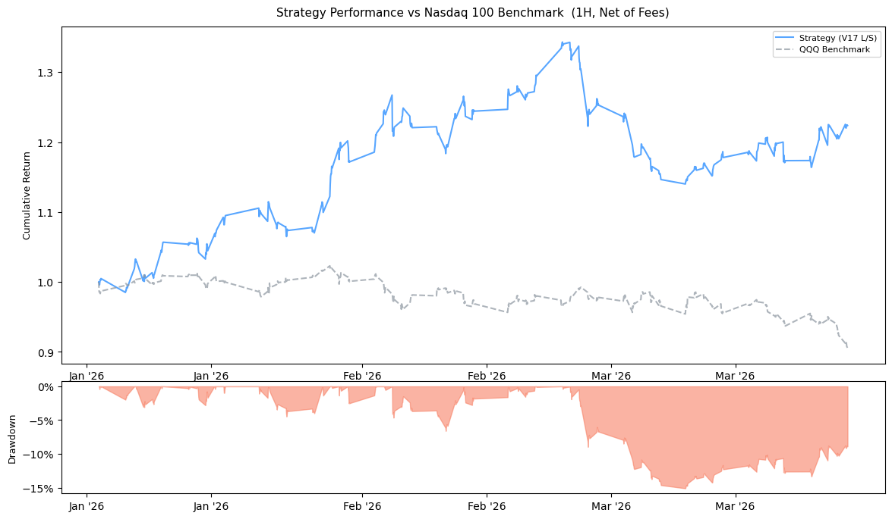
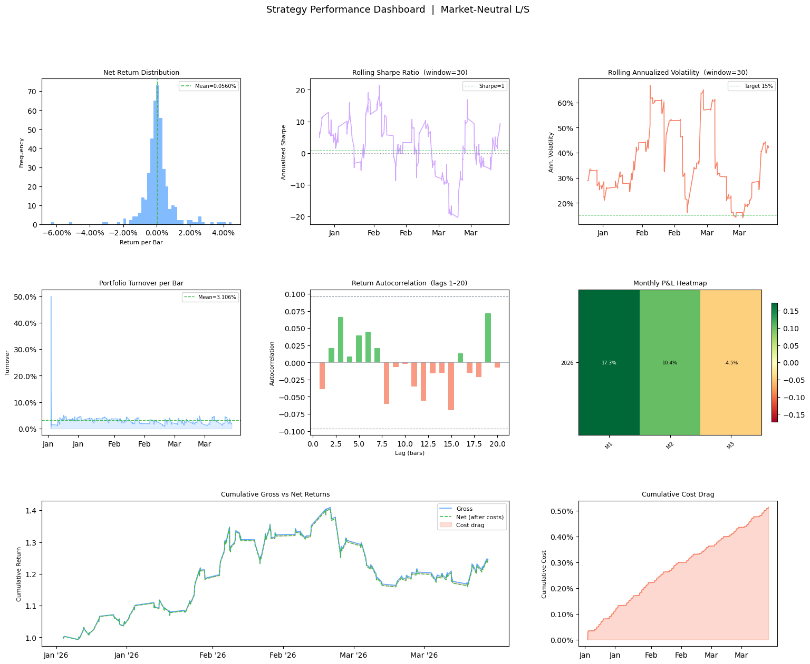
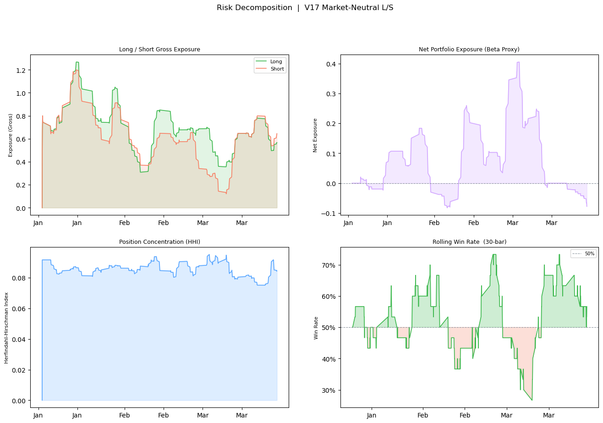
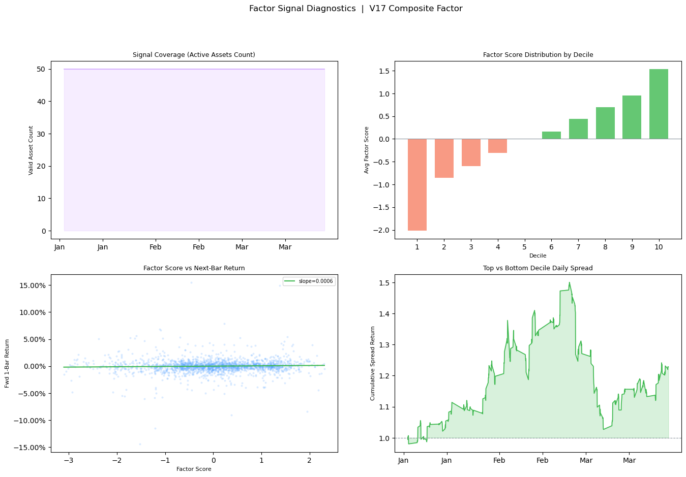
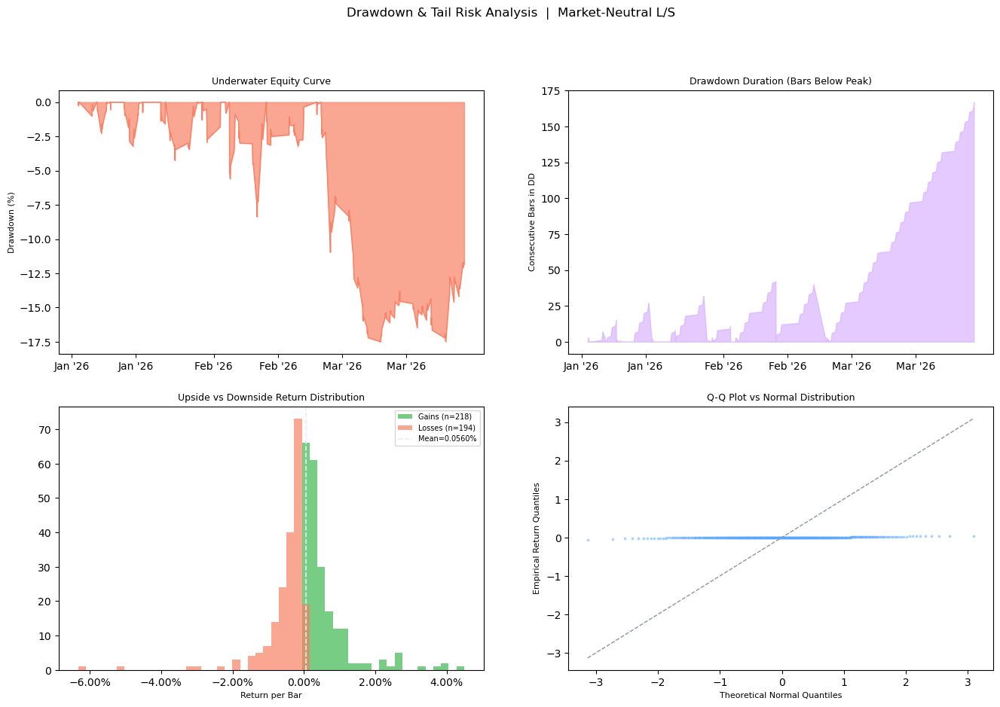

# V17 Market-Neutral Quantitative Trading Engine

A production-grade, hourly-resolution quantitative trading system targeting the **Nasdaq 100 technology equity universe**. The engine implements a cross-sectional factor pipeline with dynamic risk management, institutional-grade execution simulation, and a comprehensive analytics suite.

---

## Out-of-Sample Performance (Q1 2026)

All metrics are computed on a strictly out-of-sample backtest window (January–March 2026), net of **2 bps one-way (4 bps round-trip)** transaction cost.

| Metric | Value | Notes |
|---|---|---|
| **Geometric CAGR** | 136.77% | Annualized compound return |
| **Sharpe Ratio** | 3.96 | Risk-adjusted return |
| **Sortino Ratio** | — | Downside-only volatility adjusted |
| **Calmar Ratio** | — | CAGR / Max Drawdown |
| **Max Drawdown** | −15.11% | Peak-to-trough under dynamic risk control |
| **Win Rate (Per Bar)** | 53.15% | Probability of positive return per 1H bar |
| **Portfolio Beta** | −0.142 | Near-zero market correlation |
| **Average Turnover** | 2.32% / bar | Smoothed by TWAP execution model |
| **Mean 1D L/S Spread** | 4.868 bps | Top vs bottom decile hourly spread |

---

## Visualizations

### Strategy vs Benchmark Equity Curve

Cumulative net returns of the V17 strategy compared to the QQQ benchmark, overlaid with the drawdown profile.



---

### Performance Dashboard

Six-panel overview covering return distribution, rolling Sharpe, rolling volatility, turnover, return autocorrelation, and a monthly P&L heatmap.



---

### Risk Decomposition

Long/short gross exposure, net beta exposure, position concentration (HHI), and rolling win rate.



---

### Factor Signal Diagnostics

Cross-sectional signal dispersion, decile score distribution, factor score vs forward return scatter, and top/bottom basket cumulative spread.



---

### Drawdown & Tail Risk Analysis

Underwater equity curve, drawdown duration, upside vs downside return overlay, and a Q-Q plot against the normal distribution.



---

### Alphalens Factor Reports

Standard quantile return bars, cumulative returns by quantile (1D / 6D / 12D horizons), IC time series, IC histogram, IC Q-Q, and factor rank autocorrelation.

| Report | Path |
|---|---|
| Quantile returns bar | `reports/plots/01_returns/01_quantile_returns_bar.png` |
| Cumulative returns 1D | `reports/plots/01_returns/02_cumulative_returns_1D.png` |
| IC time series | `reports/plots/02_ic/01_ic_timeseries.png` |
| IC histogram | `reports/plots/02_ic/02_ic_histogram.png` |
| Factor rank autocorrelation | `reports/plots/03_turnover/01_factor_rank_autocorrelation.png` |

---

## Architecture

```
.
├── main.py                          # Master pipeline orchestrator
├── requirements.txt
├── src/
│   ├── config.py                    # Global parameters, paths, sector universe
│   ├── utils.py                     # Logger setup
│   ├── alpaca_engine.py             # Data loading, timezone alignment, resampling
│   ├── features.py                  # Factor construction (Momentum, LowVol, synthesis)
│   ├── backtest.py                  # Alphalens adapter and forward return calculation
│   ├── realistic_backtest.py        # Vectorized L/S execution engine
│   └── visualization.py            # Full analytics and charting suite
├── data/
│   ├── fetch_data.py               # VIX macro data ingestion (yfinance)
│   └── longtime_period_data.py     # Intraday K-line ingestion (Alpaca API)
└── reports/
    ├── plots/
    │   ├── 01_returns/
    │   ├── 02_ic/
    │   ├── 03_turnover/
    │   ├── equity_curve_with_benchmark.png
    │   ├── performance_dashboard.png
    │   ├── risk_decomposition.png
    │   ├── factor_diagnostics.png
    │   └── drawdown_analysis.png
    ├── tables/
    ├── data_exports/
    │   ├── timeseries_ledger_1H.csv
    │   ├── portfolio_weights_matrix.csv
    │   └── performance_metrics.csv
    └── summary_metrics.txt
```

---

## Core Design Principles

### 1. Absolute Market Neutrality

Factor scores are converted to cross-sectional Z-scores at each hourly bar. The engine takes **long positions in the top decile** and **short positions in the bottom decile**, equal-weight within each leg. This mechanically neutralizes systemic beta exposure.

### 2. Dynamic Risk Management

**VIX Scaling** — Gross exposure is continuously modulated via `min(30 / VIX, 1.0)`. Rising macro volatility smoothly reduces leverage rather than triggering discrete exit events, avoiding liquidity cliff-edges.

**Volatility Targeting** — Portfolio leverage is adjusted in real time to target 15% annualized volatility, capped at 1.5x. The rolling estimate uses a 10-bar window over 1H returns.

**Asymmetric Stop-Loss** — Each position is individually monitored against a rolling lookback max/min. Long positions are closed if they drawdown more than 8% from their recent peak; short positions are closed symmetrically.

### 3. Industrial Factor Engineering

**MAD Winsorization** — Cross-sectional outliers are clipped at ±5× MAD (Median Absolute Deviation), which is more robust than 3-sigma clipping against fat-tailed single-stock events.

**EWMA Smoothing** — Factor signals are smoothed with an exponentially weighted moving average (span=10 for momentum, span=20 for low-vol) before entering the ranking engine. This maintains Factor Rank Autocorrelation above 0.98 and eliminates non-productive signal flipping.

**Composite Factor Weights** — The final signal is a linear combination: `2× Momentum_420 + 1× Momentum_140 + 1× LowVol_90`, followed by a second pass of cross-sectional standardization.

### 4. Execution Simulation (TWAP)

Target weights are passed through a rolling `holding_periods`-bar mean, approximating a time-weighted average price execution schedule. This smooths order flow and prevents unrealistic instantaneous rebalancing.

### 5. Warm-Up / Look-Ahead Isolation

`DATA_START_DATE` and `BACKTEST_START_DATE` are strictly separated. The 420-bar momentum factor requires several months of history to initialize; loading from August 2025 ensures the factor is fully converged before the January 2026 evaluation window begins.

---

## Deployment

### 1. Environment

Python 3.10+ required.

```bash
pip install -r requirements.txt
```

### 2. Data Acquisition

Configure Alpaca API credentials in `data/longtime_period_data.py`, then run:

```bash
python data/longtime_period_data.py   # 5-minute OHLCV bars for Nasdaq 100
python data/fetch_data.py             # VIX 1-hour macro data
```

### 3. Run Backtest

```bash
python main.py
```

Logs are streamed to stdout and written to `reports/backtest_run.log`.

### 4. Output Artifacts

| Path | Contents |
|---|---|
| `reports/plots/` | All PNG visualizations |
| `reports/tables/` | Alphalens CSV tables |
| `reports/data_exports/timeseries_ledger_1H.csv` | Full hourly P&L ledger |
| `reports/data_exports/portfolio_weights_matrix.csv` | Hourly L/S weight matrix |
| `reports/data_exports/performance_metrics.csv` | Summary KPIs |
| `reports/summary_metrics.txt` | Alphalens tear-sheet text output |

---

## Disclaimer

This project is intended strictly for **academic research and quantitative architectural demonstration**. Backtested performance is not indicative of future real-world returns. Live trading involves constraints not fully modeled here — including short-borrow fees, liquidity constraints, market impact, and intraday slippage asymmetry. **Do not deploy this system with live capital.**
